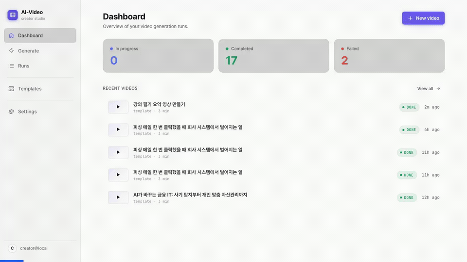
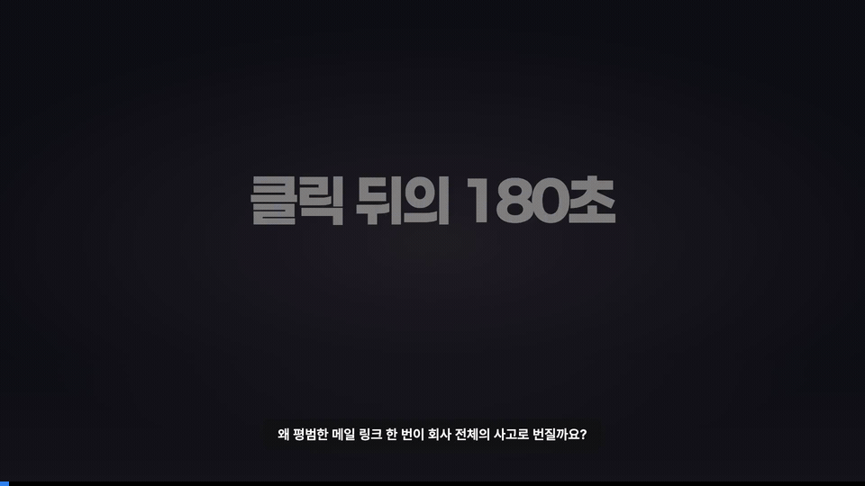

# AI 영상 자동화 파이프라인

학습 원문을 그대로 다시 읽는 대신, 핵심을 짧은 요약 강의 영상으로 확인할 수 있도록 만든 로컬 제작 도구입니다. 입력 보고서나 주제를 바탕으로 대본, TTS, 슬라이드, 장면, MP4 출력까지 하나의 흐름으로 연결합니다.

## 포트폴리오 공개 스냅샷

이 저장소는 선별된 공개 파일을 별도 공개 계보로 관리하는 포트폴리오 스냅샷입니다. 설치, 실행, API 사용 흐름과 실제 결과 예시를 함께 제공합니다.

## 문제

강의나 학습 필기를 다시 볼 때 긴 원문을 그대로 읽기보다, 핵심만 정리된 짧은 요약 강의 영상으로 확인하고 싶었습니다.

## 왜 만들었는가

AI-Video는 템플릿, TTS, 구조화된 콘텐츠를 연결해 입력에서 대본, 음성, 슬라이드와 장면, 최종 MP4까지 이어 주는 로컬 제작 도구입니다. 같은 품질 기준의 학습용 영상을 반복해서 만들 수 있도록 구성했습니다.

## 데모

### AI Video 제작 과정



실제 생성 실행 없이 Guided Generate UI 흐름을 보여주는 데모입니다. dark/black 도입부를 제거해 white UI Dashboard에서 시작합니다.

### 실제 생성 결과



실제 생성 결과에서 화면 전환이 안정적인 5개 구간을 2초씩 연결한 10초 무음 미리보기입니다. 하단 bar는 원본 영상 위치가 아니라 GIF 재생 진행률을 나타내며, 처음부터 끝까지 연속적으로 증가합니다.

[내레이션이 포함된 전체 MP4 다운로드](docs/demo/phishing-email-incident-response.mp4)

세 미디어의 역할과 사양은 [데모 자료 안내](docs/demo/README.md)에서 확인할 수 있습니다.

---

## 구성

| 컴포넌트 | 포트 | 설명 |
|----------|------|------|
| Backend API | `8902` | FastAPI — 런 생성·조회·취소 |
| Frontend | `3902` | React SPA — 대시보드 UI |

개발과 공개 운영 환경이 충돌하지 않도록 공개 운영 기본값은 Backend `8902`, Frontend `3902`입니다.

---

## 설치

```bash
# 1. Python 가상환경 생성
python3 -m venv .venv
source .venv/bin/activate

# 2. 의존성 설치
pip install -r requirements.txt

# 3. 환경변수 설정
cp .env.example .env
# .env 에 AIVIDEO_DATABASE_URL, AZURE_SPEECH_KEY, AZURE_SPEECH_REGION 등 필수 값 입력
```

---

## 실행

```bash
# Backend + Frontend 동시 시작
bash scripts/start.sh

# 상태 확인 / 중지
bash scripts/status.sh
bash scripts/stop.sh

# 또는 개별 실행
# Backend (port 8902)
uvicorn api.app:app --host 0.0.0.0 --port 8902

# Frontend (port 3902)
python frontend/server.py
```

---

## 기본 API

```bash
# 헬스체크
curl http://localhost:8902/health

# 런 생성
curl -X POST http://localhost:8902/runs \
  -H "Content-Type: application/json" \
  -d '{"topic":"python-async","language":"ko","mode":"template"}'

# 런 목록 조회
curl "http://localhost:8902/runs?limit=10"

# 템플릿 목록
curl http://localhost:8902/templates

# 생성 프로파일
curl http://localhost:8902/profiles
```

---

## 환경변수 (필수)

```
AIVIDEO_DATABASE_URL   # PostgreSQL URL
# 또는 DATABASE_URL
AZURE_SPEECH_KEY       # Azure TTS API 키
AZURE_SPEECH_REGION    # Azure 리전 (예: koreacentral)
AIVIDEO_BACKEND_PORT   # 기본 8902
AIVIDEO_FRONTEND_PORT  # 기본 3902
```

전체 환경변수 목록은 `.env.example`을 참조하세요.

---

## 파이프라인 직접 실행 (CLI)

```bash
# 기본 실행
python pipelines/run_pipeline.py --topic <slug>

# 단계별 실행
python pipelines/run_pipeline.py --topic <slug> --stop-after=tts
python pipelines/run_pipeline.py --topic <slug> --stop-after=scenes
python pipelines/run_pipeline.py --topic <slug> --dry-run
```
